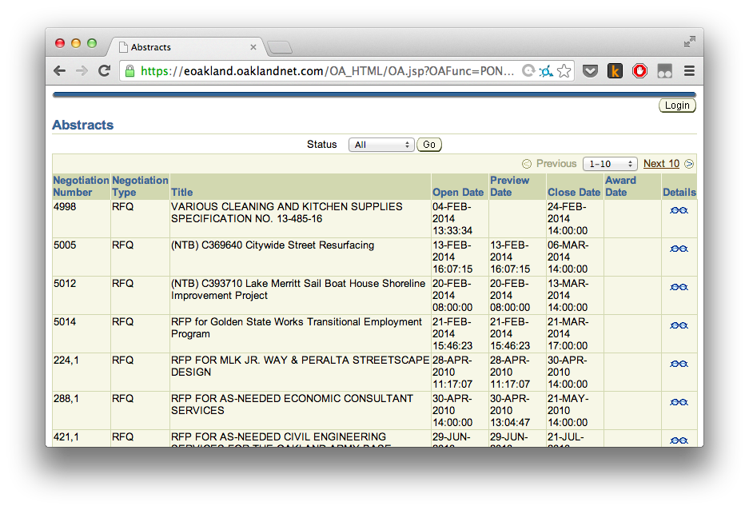
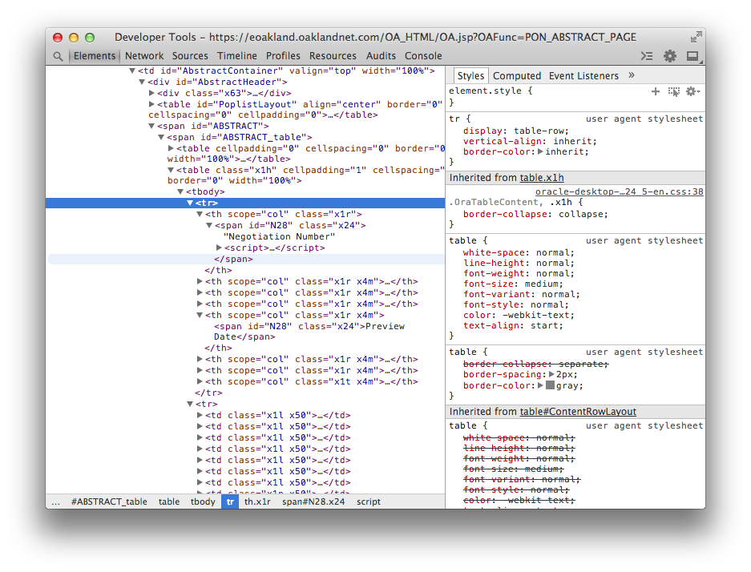

# web scraping with node

an introduction to extracting machine readable data from web pages

written for Oakland Data Day 2014, part of the international Open Data Day

loosely based on a previous article I wrote: http://maxogden.com/scraping-with-node.html

## when to scrape

- if a page doesn't have a 'Download as CSV' or similar data export option
- if the data looks potentially interesting
- if the data displayed on the page seems to be served from a database
- e.g. a search form that shows 25 results at a time
- if the data on the page seems to be dynamic, e.g. it gets updated over time
- if the data isn't available through an open data site

## determining if a page is scrapeable

I'll use the [Oakland Contracting Opportunities](https://eoakland.oaklandnet.com/OA_HTML/OA.jsp?OAFunc=PON_ABSTRACT_PAGE) website as an example.  



Since all the contracts are on one page this will make writing a scraper much easier.

Before we start writing the scraper, let's look at the HTML to see how straightforward it is. In Chrome, right click on one of the photos and choose "Inspect Element' to bring up the HTML inspector in the Chrome Developer Tools.



As is shown above, the contracts are in an html `<table>` with the classname `x1h`. This means that we can easily access each contract by this classname. HTML elements without unique indentifiers like this are trickier to access, but this one should be relatively easy.

Now that we have found the page we want to scrape, and have looked at the HTML to make sure it is possible, let's dive into writing the scraper.

## scraping html

There are many different programming languages that you can use to write scrapers, but I'm going to show how using Node.js as it's what I'm most comfortable with.

The following commands are meant for Linux or Mac users. If you are on Windows the concepts will be the same but the commands will be different. Ask someone for help translating these to Windows if you are unsure what the WIndows versions of the commands are.

First, make a new folder for your scraper (call it whatever you want, i'll call mine `scraper` below), and go into that folder in your command line terminal. (Note: don't enter the commands that start with `#`, they are just comments)

```
# print what directory you are working in, to make sure you are in the right place
pwd
# output: /Users/max
mkdir scraper
cd scraper
pwd
# output: /Users/max/scraper
npm init
```

At this point `npm init` will ask you a series of questions. Say `y` to all of them. All that does is create a file called `package.json` inside your scraper folder. `package.json` is just a file to describe the details of your scraper.

Now install the two modules that we'll use to scrape, `request` for requesting website HTML and `cheerio` for reading HTML:

```sh
npm install --save request cheerio
```

The `--save` will save the two modules in your `package.json` in addition to installing them, so that later you (or other running your code) can install the required modules easily.

Now make a new empty file called `index.js` with your preferred text editor and put the following code in it:

```js
// load the modules we need
var request = require('request')
var cheerio = require('cheerio')

// the page we want to request from the internet
var page = "https://eoakland.oaklandnet.com/OA_HTML/OA.jsp?OAFunc=PON_ABSTRACT_PAGE"

// this will make an HTTP request, similar to loading the page in your browser
// but instead of showing it, when the page is done loading it will call a
// function we pass in with the HTML from the page (and some other info too)
request(page, gotPage)

function gotPage(error, response, html) {
  // an error might have happened if, for example, your computer is not
  // connected to the internet or if the remote website is down
  if (error) console.log(error)
  
  // Print out the status code. If a status code is 300 or above it means something went wrong.
  console.log("Status Code:", response.statusCode)
  
  // Finally, let's print out the HTML
  console.log(html)
}
```

Let's try running it! Run `node index.js` in your terminal and you should see something like this:

```
$ node index.js 
Status Code: 200
<!DOCTYPE html PUBLIC "-//W3C//DTD XHTML 1.0 Transitional//EN" </html>
-- full html output not shown --
```

A status code of `200` means everything went OK, and we got all the HTML. Now we need to add some code to parse out our data from that HTML using cheerio:


```js
var request = require('request')
var cheerio = require('cheerio')
var fs = require('fs')

var page = "https://eoakland.oaklandnet.com/OA_HTML/OA.jsp?OAFunc=PON_ABSTRACT_PAGE"

var options = {
  rejectUnauthorized: false,
  url: page
}
request(options, gotPage)

function gotPage(error, response, html) {
  if (error) console.log(error)
  
  console.log("Status Code:", response.statusCode)
  
  // instead of console.log'ing the html, pass the html into the
  // getInfo function:
  getInfo(html)
}


function getInfo(html) {
  var $ = cheerio.load(html)
  // get all rows
  var contracts = $('.x1h tr')
  
  // cleanup: remove all <script> tags from the table (so they dont show up in our data)
  contracts.find('script').remove()
  
  // the first tr is the header row
  var headers = contracts[0]
  
  // get only the <th> elements from the header row
  var headers = $(headers).find('th')
  
  // remove the header row from our contracts array
  contracts = contracts.slice(1)
  
  // to store our data objects that we are about to create
  var dataArray = []
  
  // loop over each row, tdEl stands for <td> element
  contracts.each(function(num, tdEl) {
    var cells = $(tdEl).find('td')
    var data = {}
    
    // loop over each header, thEl stands for <th> element
    headers.each(function(num, thEl) {
      var headerText = $(thEl).text()
      var cellText = $(cells[num]).find('span').text()
      data[headerText] = cellText
    })
    
    // add the current object to the data array
    dataArray.push(data)
  })
  
  // now that we're done, pass the data array to saveInfo
  saveInfo(dataArray)
}

function saveInfo(dataArray) {
  console.log(dataArray)
}
```
